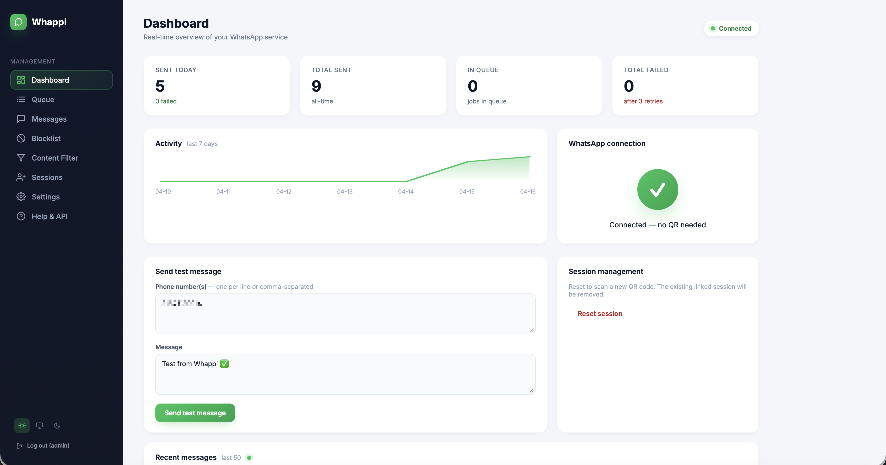
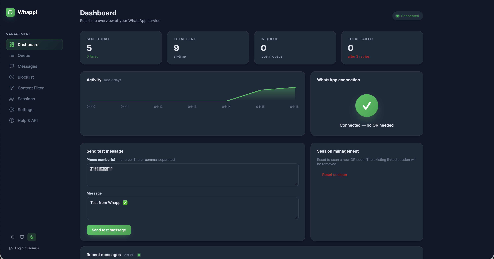
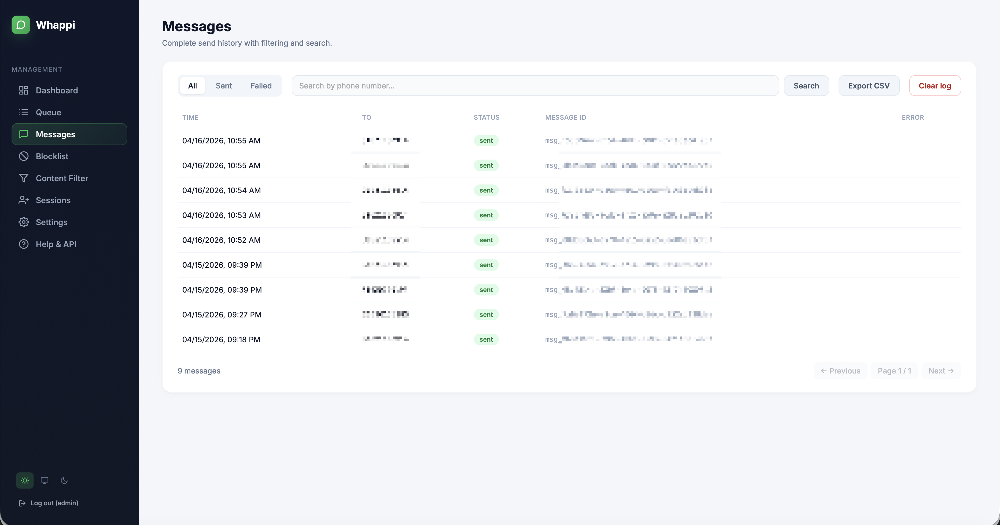
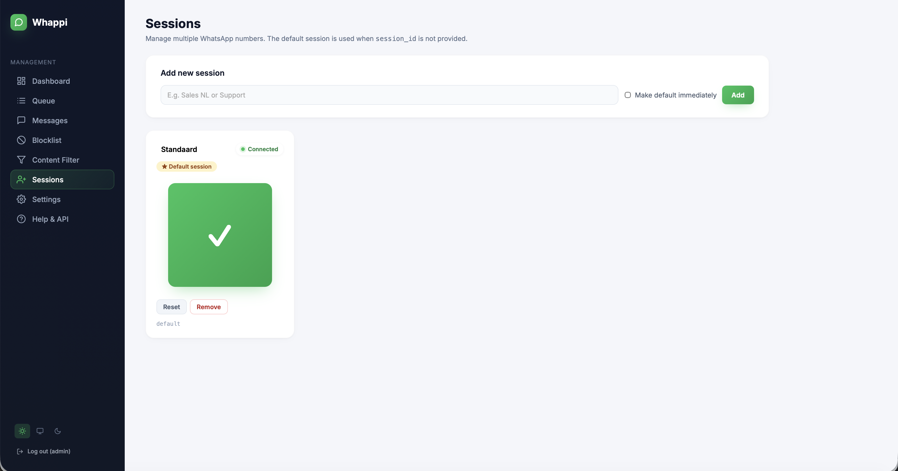
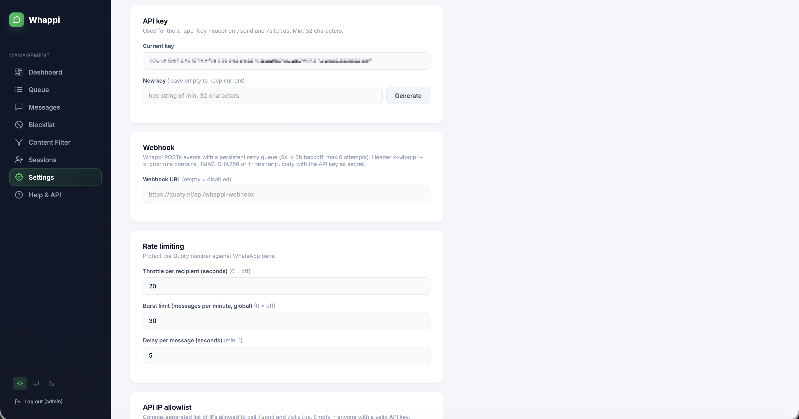
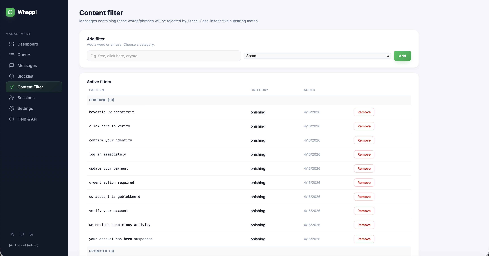
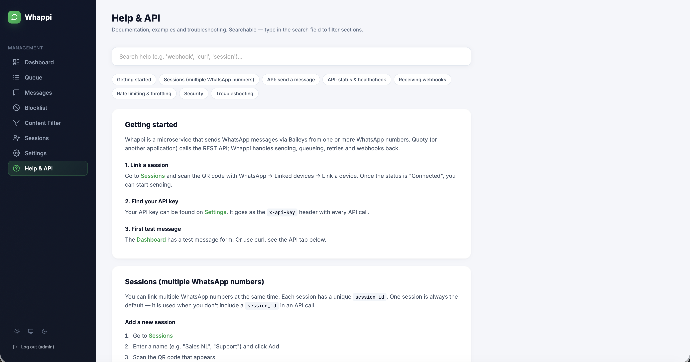

<p align="center">
  
</p>

<p align="center">
  <strong>WhatsApp sender microservice with admin dashboard.</strong><br/>
  Sends messages via <a href="https://github.com/WhiskeySockets/Baileys">Baileys</a> (unofficial WhatsApp protocol) and exposes a REST API for integration with your application.
</p>

<p align="center">
  
  
</p>

## Features

- **REST API** — `POST /send` with queue, retries and rate limiting
- **Multi-session** — multiple WhatsApp numbers simultaneously
- **Admin dashboard** — realtime stats, test messages, QR scanner, message log
- **Webhooks** — HMAC-signed delivery events with persistent retry queue
- **Content filter** — block messages with spam/phishing triggers
- **Number blocklist** — reject specific phone numbers
- **SQLite** — persistent queue, history and settings
- **Mobile-friendly** — responsive dashboard with hamburger menu

## Quick Start

```bash
git clone https://github.com/brandforwardnl/Whappi.git
cd whappi
./setup.sh
npm start
```

The setup wizard installs dependencies, builds the project and creates a `.env` file with a generated API key.

Open `http://localhost:3100/admin`, log in and scan the QR code to connect WhatsApp.

## Manual Installation

```bash
npm ci
npm run build
cp .env.example .env
# Edit .env — generate an API key:
# node -e "console.log(require('crypto').randomBytes(32).toString('hex'))"
npm start
```

## API

### POST /send

```bash
curl -X POST http://localhost:3100/send \
  -H "Content-Type: application/json" \
  -H "x-api-key: <YOUR_API_KEY>" \
  -d '{"to":"31612345678","message":"Hallo!"}'
```

**Body:**
| Field | Type | Required | Description |
|-------|------|----------|-------------|
| `to` | string \| string[] | yes | Phone number(s), digits only with country code |
| `message` | string | yes | Message text |
| `session_id` | string | no | Specific WhatsApp session (default = default) |
| `quoty_customer_id` | string | no | Returned in webhook |
| `metadata` | object | no | Returned in webhook |

**Response:** `{ "queued": true, "message_id": "msg_..." }`

### GET /status

Requires `x-api-key` header.

```json
{ "whatsapp": "open", "queue_length": 0, "uptime_seconds": 3600 }
```

### GET /healthz

Public (no auth). `200` if WhatsApp connected, `503` if offline.

## Webhooks

Set a webhook URL via the dashboard (Settings). Whappi POSTs events with HMAC-SHA256 signature:

- `message.sent` — message sent successfully
- `message.failed` — message permanently failed (after 3 retries)
- `whatsapp.connected` / `whatsapp.disconnected` — session status

Headers: `x-whappi-timestamp` + `x-whappi-signature` (HMAC over `{timestamp}.{body}` with API key).

## Deployment with PM2

```bash
npm install -g pm2
pm2 start ecosystem.config.js
pm2 save
pm2 startup
```

## Environment Variables

| Variable | Description | Default |
|----------|-------------|---------|
| `PORT` | Server port | `3100` |
| `INTERNAL_API_KEY` | API key (min. 32 characters) | — |
| `ADMIN_USER` | Dashboard username | — |
| `ADMIN_PASSWORD` | Dashboard password | — |
| `NODE_ENV` | `production` or `development` | `production` |

After first start, all settings (including API key and credentials) can be changed via the dashboard.

## Project Structure

```
src/
  index.ts          — Fastify server bootstrap
  whatsapp.ts       — Baileys multi-session manager
  queue.ts          — Send queue with retries and throttle
  db.ts             — SQLite schema and queries
  settings.ts       — Configuration in DB
  events.ts         — SSE event bus
  webhook.ts        — Webhook dispatcher
  webhookQueue.ts   — Persistent webhook retry queue
  throttle.ts       — Per-recipient and burst rate limiting
  loginGuard.ts     — Brute-force protection
  routes/
    send.ts         — POST /send
    status.ts       — GET /status
    admin.ts        — Dashboard, sessions, messages, settings, etc.
    helpPage.ts     — Help & API documentation
  middleware/
    apiKey.ts       — x-api-key + IP allowlist validation
```

## Screenshots

| | |
|---|---|
|  **Messages** — Full send history with filters, search and CSV export |  **Sessions** — Manage multiple WhatsApp numbers with QR pairing |
|  **Settings** — API key, webhooks, rate limiting, IP allowlist |  **Content Filter** — Block messages containing spam triggers |
|  **Help & API** — Searchable docs with copyable code examples | |

## Risk

Baileys uses an unofficial WhatsApp protocol. WhatsApp can block accounts for:
- Too high message volume
- Many unknown recipients
- Spam reports by recipients

Use Whappi only for relevant, transactional messages to known contacts. For production at scale: consider the official WhatsApp Business API.

## License

MIT
